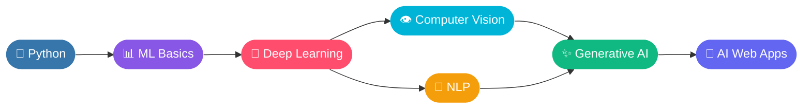

<!-- ═══════════════ ANIMATED HEADER ═══════════════ -->
<div align="center">


<a href="https://sudhir-baghel.vercel.app/">
  
</a>

<br/><br/>


<br/>


<a href="https://github.com/sudhirbaghel963-ai?tab=followers"></a>

<br/><br/>

<a href="https://sudhir-baghel.vercel.app/"></a>
<a href="mailto:sudhirbaghel963@gmail.com"></a>

</div>


## 👨‍💻 About Me

<table>
<tr>
<td width="55%" valign="top">

```yaml
👤 name:         Sudhir Baghel
💼 role:         AI/ML Enthusiast & Developer
🎯 focus:        AI-powered web apps · Computer Vision
🌱 learning:     ML · DL · CV · NLP · Generative AI
👯 open_to:      Collaboration on AI/ML & CV projects
🤝 needs_help:   Scaling AI apps & deploying ML models
💬 ask_me:       Python · ML · Computer Vision · React
⚡ fun_fact:     I turn AI ideas into real apps 🚀
```

</td>
<td width="45%" valign="top">

🔭 **Working on** &nbsp;AI-powered web apps & computer vision projects

🌱 **Learning** &nbsp;Machine Learning, Deep Learning, NLP, GenAI

👯 **Collaborate** &nbsp;AI/ML, Computer Vision & AI web dev

🤝 **Need help with** &nbsp;Scalable AI apps & model deployment

📫 **Reach me** &nbsp;[sudhirbaghel963@gmail.com](mailto:sudhirbaghel963@gmail.com)

</td>
</tr>
</table>


## 🧭 My AI Journey




## 🛠️ Tech Arsenal

<div align="center">

**🤖 AI · ML · Data**


**🌐 Web Development**


**🗄️ Databases · Cloud · DevOps**


**🎨 Design · Languages**


</div>


## 📊 GitHub Analytics

<div align="center">


<br/><br/>


</div>


## 📈 Contribution & Commit Activity

<div align="center">


</div>


## 🏆 Trophy Cabinet

<div align="center">

<a href="https://github.com/ryo-ma/github-profile-trophy">
  
</a>

</div>


## 🚀 Featured Projects

<div align="center">

Every project I build, with live demos and source code, is on my portfolio.

<a href="https://sudhir-baghel.vercel.app/">
  
</a>
<a href="https://github.com/sudhirbaghel963-ai?tab=repositories">
  
</a>

</div>

---

## 🤝 Let's Connect

<div align="center">

I'm open to collaborations on **AI/ML, Computer Vision & AI-powered web apps**.
Got an idea? Let's build it together. 💡

<a href="https://sudhir-baghel.vercel.app/"></a>
<a href="mailto:sudhirbaghel963@gmail.com"></a>
<a href="https://github.com/sudhirbaghel963-ai"></a>

<br/><br/>


</div>
